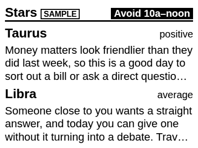
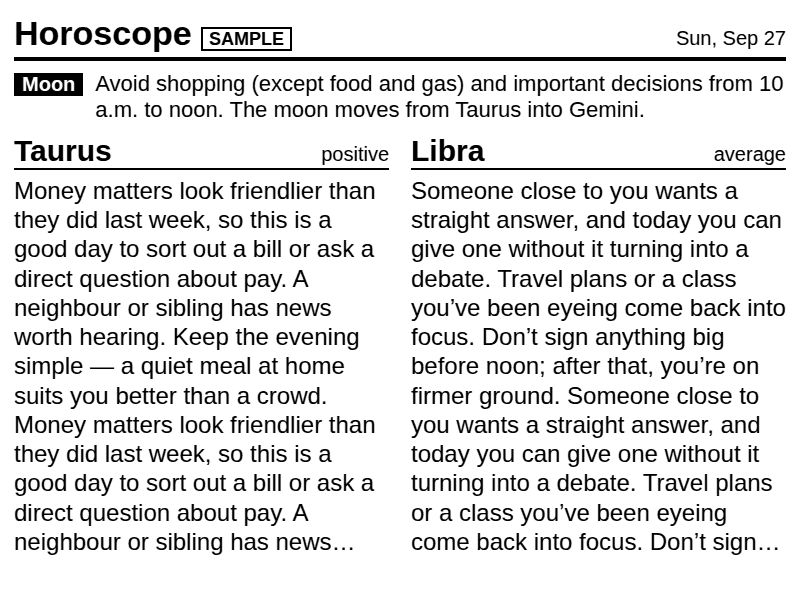

# Horoscope tile — scoping

**Status:** spike. Written 2026-09-27.

What exists in this PR:
- `server/horoscope-service.js`, with 39 tests, all passing.
- A synthetic fixture feed.
- A `/api/horoscope` route.
- Recipe drafts in `byos-recipes/horoscope/`.

What has not happened:
- Nothing has been fetched from the real source. See "Evidence" below.
- Nothing is deployed, and no recipe has been imported.

**Want:** the Chicago Sun-Times daily horoscope for **Taurus** and **Libra**,
plus the **Moon Alert**. It is Georgia Nicols' syndicated column.

## Evidence: what was and wasn't tested

This cloud session's egress proxy **blocks** `chicago.suntimes.com` and
`georgianicols.com`: both curl and WebFetch got a CONNECT 403. So nothing below
comes from a live fetch made here. The evidence comes from three places:

1. **Web search results.** URL patterns, the Terms of Use text, and the
   dropping of the paywall.
2. **Archived copies of the Sun-Times RSS feed** in a public GitHub dataset
   (`NewsAppsUMD/beat-book`, `chicago-public-media/all_jsons`). It stores the
   full HTML of each item, with 10 horoscope items from February to June 2026.
   A research sub-agent found it through GitHub code search and extracted the
   structure. That tells us the feed's shape as of mid-2026. It does not tell
   us today's shape.
3. **Syndicated copies** from other outlets, for comparing the timezones used
   in the Moon Alert.

Treat every "confirmed" below as *confirmed in archived or secondary sources*.
The first job of the local-deploy checklist is to check it against the live
feed.

## Source evaluation

| Source | Access | ToS / robots | Markup stability | Moon Alert times | Update timing | Verdict |
|---|---|---|---|---|---|---|
| **Sun-Times site RSS**, `https://chicago.suntimes.com/rss/index.xml` | Free. The paywall was dropped on 2022-10-06. The feed was observed returning 200 with about 55 items (a third-party audit on 2026-08-01). | The Terms of Use forbid automated access or scraping "without express, prior written permission". Still, RSS is the channel the site publishes for automated readers. Its `robots.txt` has not been checked. | Brightspot since early 2024 (Chorus before that), so the CMS has changed once in 2 years. The item body is the **full article HTML**. | **Central** ("…from 10 a.m. to noon", sometimes "Chicago time") | Item `published` is **00:01 CT** on day D in every sample checked | ✅ **Primary** |
| Sun-Times article page `/horoscopes/YYYY/MM/DD/horoscopes-today-…` | Free | Scraping HTML pages is exactly what the Terms of Use prohibit | The slug is **unstable**: padding changed in 2025, one slug had a typo (`horoscopea-`), another carried the wrong date in its path | Central | 00:01 CT | ❌ Don't scrape it. RSS carries the same HTML anyway. |
| Sun-Times `/horoscopes` index and `/authors/georgia-nicols` | Free | Same as above | Unknown | — | — | Only useful for finding the article URL, which RSS already gives |
| `georgianicols.com/daily/` (also `/daily/today`, `/daily/YYYY-MM-DD`) | Free to view | Not checked (blocked here). Probably a custom CMS: no sign of `wp-json`, no RSS. | Unknown | **Eastern** in syndication ("until 1 p.m. EDT (10 a.m. PDT)"), so it would need converting to Chicago time | Unknown | Fallback only, and only after checking its terms |
| georgianicols.com **"Daily Hit" email** (`/hit/`, $4.99/month) | Paid, sent to your inbox | Paying for the author's own product is the cleanest licensing position | Email templates tend to be stable | Probably Eastern | Daily email | 💡 The licence-clean alternative. It needs mailbox plumbing (see below). |
| Syndicated copies (Press Democrat `…/daily-horoscope-for-<month>-<d>-<yyyy>/`, Hearst `…georgia-nicols-horoscope-…-<id>.php`) | Varies | Each outlet has its own terms | The Hearst ids can't be predicted, and Press Democrat abbreviates months inconsistently | EDT/PDT | Varies | ❌ |
| Generic horoscope APIs (horoscope-app-api, API Ninjas…) | Free | Their own terms | — | — | — | ❌ The content is **not** Georgia Nicols'. Don't fall back to it silently. |

### The ToS question, stated plainly

- The Sun-Times Terms of Use
  (<https://chicago.suntimes.com/legal/terms-of-use>) prohibit accessing the
  site "using automated means (such as harvesting bots, robots, spiders, or
  scrapers)" without prior written permission.
- A feed reader polling the RSS feed that the Sun-Times publishes is the use
  that feed exists for.
- This service behaves like one: it makes **one successful fetch a day** plus
  throttled retries, sends a truthful `User-Agent`, never requests article
  pages, is for personal display only, and does not redistribute.
- That is low risk, but not zero. There are three ways to handle it:
  1. **Go ahead with RSS only.** This is what the spike does.
  2. **Email the Sun-Times** and ask for permission for a personal e-ink
     display. It is cheap and removes the ambiguity.
  3. Switch to the **Daily Hit email**. That needs IMAP polling on the Mac
     (not the Pi, to keep mail credentials off the Pi-hole box) and a
     text/HTML parser for that email's format. It is more plumbing but
     licence-clean.
- Whichever is chosen: **never commit a real captured column to the repo.**
  The fixture in this PR is synthetic: its structure mirrors the feed, and
  its text is original placeholder copy. Real columns live only in
  `cache/horoscope_cache.json`, which is gitignored.

## Markup facts the parser relies on

These come from the archived feed HTML, February to June 2026. The
local-deploy checklist re-checks them against the live feed.

- Each item body starts with `<h2>Moon Alert</h2><p>…</p>`. The heading is
  **sometimes "Moon alert"**, so match it case-insensitively.
- Then there is one `<h2>` per sign, **`Taurus (April 20-May 20)`** and
  **`Libra (Sept. 23-Oct. 22)`**.
  - It is followed by a `HoroscopeStarbox` element whose text reads "A
    **positive** / **average** / **dynamic** / **so-so** day".
  - Then comes the column text in `<p>`.
- The body ends with `<h2>If today is your birthday</h2>`. There are no
  "Tonight:" lines.
- **Item identification** uses the title, e.g. "Horoscope for Sunday,
  September 27, 2026". Days were unpadded until early 2025 and zero-padded
  since. Slugs are unreliable, so the parser never builds or parses URLs.
- **Moon Alert phrasings seen:**
  - "Avoid shopping (except food and gas) and important decisions from 10 a.m.
    to noon. The moon moves from Taurus into Gemini."
  - "…after 3:15 a.m. Chicago time today."
  - "There are no restrictions to shopping or important decisions today. The
    moon is in Pisces."
  - The Sun-Times version has already been **shifted to Central**. Syndicated
    copies say EDT/PDT: for April 19 they gave 11 a.m.–1 p.m. EDT where the
    Sun-Times gave 10 a.m.–noon. That is a real reason to prefer this source
    for a Chicago wall.
- **Item lifetime.** The main feed holds about 55 items, and a 00:01 item may
  scroll out later in the day. That is fine if we fetch early and cache for
  the day, which the service does. If the Pi restarts mid-day with an empty
  cache, it will show `expired-cache`/`fixture` until the next day. A
  `/rss/horoscopes.xml` section feed may exist, based on the `/rss/news.xml`
  and `/rss/sports.xml` pattern, but it is **unverified**.

## Service design (as implemented)

`server/horoscope-service.js` has **no new dependencies**, deliberately:
`deploy-to-pi.sh` doesn't reliably run `npm install` (review F4). It follows
`transit-service.js`, but with the cache keyed by **date** instead of mtime,
since the column changes once a day.

```
getHoroscopeData(now)
  today's cache      (cache.date === today in America/Chicago)      -> source 'cache'
  live RSS fetch     (<= 1 per HOROSCOPE_RETRY_MS while today's is missing)
      today's item                                                  -> 'api',  stale:false
      newest older item, if >= the cached one                       -> 'api',  stale:true
  older cache                                                       -> 'expired-cache', stale:true
  fixture feed       (synthetic, parsed by the same code path)       -> 'fixture'
```

- **Parsing**: a regex split of `<item>` blocks → the title date → the body
  (`content:encoded` or `description`, CDATA or entity-escaped) → a split on
  `<h2>` → Moon Alert plus the configured signs.
- **Robustness**:
  - It follows up to 3 redirects, caps the feed at 5 MB, and has a 15 s
    timeout.
  - Cache writes go to a temp file and are then renamed (review F17), so a
    torn write can't fall through to the fixture.
- **Config** (all optional, with defaults in `config.js`):
  - `HOROSCOPE_SIGNS=taurus,libra`. Order is preserved; unknown signs are
    dropped.
  - `HOROSCOPE_FEED_URL`
  - `HOROSCOPE_RETRY_MS` (default 30 min)
- **Not in the spike**: fetching the article page as a fallback (ToS), a
  georgianicols.com adapter, and the Daily Hit email path.

### Request budget

- BYOS polls `/api/horoscope` every `refresh_interval` (60 min in the draft
  `settings.yml`).
- The first poll after 00:01 CT that finds today's item caches it. Every other
  poll that day is a cache hit.
- The worst case is a column that is late or missing all day. BYOS's 60-minute
  poll then caps it at about 24 feed fetches a day. The 30-minute throttle is
  the cap if something else polls more often. Each fetch is around 1 MB. The
  typical case is 1–2 a day.

## `/api/horoscope` payload

This is what the fixture yields, with the long text shortened to `…`. It comes
from `curl localhost:3000/api/horoscope` on a local run, where the live fetch
got a 403 from the egress proxy and fell back to the fixture:

```json
{
  "date": "2026-09-27",
  "dateLabel": "Sun, Sep 27",
  "title": "Horoscope for Sunday, September 27, 2026",
  "link": "https://chicago.suntimes.com/horoscopes/2026/09/27/horoscopes-today-sunday-september-27-2026",
  "author": "Georgia Nicols",
  "moonAlert": {
    "text": "Avoid shopping (except food and gas) and important decisions from 10 a.m. to noon. The moon moves from Taurus into Gemini.",
    "clear": false,
    "avoidFrom": "10 a.m.",
    "avoidUntil": "noon",
    "moonFrom": "Taurus",
    "moonSign": "Gemini",
    "headline": "Avoid 10a–noon"
  },
  "signs": [
    {
      "sign": "taurus",
      "name": "Taurus",
      "dates": "April 20-May 20",
      "rating": "positive",
      "text": "Money matters look friendlier than they did last week, …",
      "teaser": "Money matters look friendlier than they did last week, so this is a…"
    },
    { "sign": "libra", "name": "Libra", "dates": "Sept. 23-Oct. 22", "rating": "average", "text": "…", "teaser": "…" }
  ],
  "stale": false,
  "source": "fixture",
  "_timestamp": "<ms epoch>"
}
```

Field notes:

- **`moonAlert.headline`** is a compact label for the quadrant header: "All
  clear", "Avoid 10a–noon", "Avoid after 3:15a", "Avoid until 1p", or "Moon
  alert" when the wording isn't recognised. `text` always carries the full
  sentence.
- **`stale`** is true whenever the column shown isn't today's. The recipes
  show a "from Sat, Sep 26" footer.
- **`source`** follows the existing convention. The recipes put a **SAMPLE**
  badge on `fixture`, which is review F3's fix applied here from the start.
- **`teaser`** isn't used by the recipes, which clamp `text` instead. It is
  there for text-only consumers, such as the Discord morning post in
  `discord-llm.md`.

## Recipe drafts

These are in `byos-recipes/horoscope/`: `settings.yml` (with **no `id:` yet**,
see the checklist), `quadrant.liquid` and `full.liquid`.

- The type floor is respected: nothing is under 16px. Body text is 22–24px,
  headers 26px (quadrant) and 34px (full).
- They use `-webkit-line-clamp` rather than Liquid `truncate`. BYOS renders in
  headless Chromium, so the clamp fills exactly the rows available whatever
  the column length. In the quadrant, two sign names and three lines each fill
  the 400×300 slot (the "fill whitespace" rule).
- **Only `full` and `quadrant` exist.** Don't put this recipe in a
  `half_vertical` or `half_horizontal` slot (for example the right side of a
  2Lx1R, or a 1Tx1B) until a variant for that size is written. Otherwise it
  silently falls back to `full` (the `Plugin.php:948` trap in
  `BYOS_RECIPES.md`).

The previews below are a **rough local check only**: liquidjs plus Chromium,
**without TRMNL's framework CSS**, and neither BYOS nor the Kindle panel. The
full preview uses doubled text to test the clamp against realistic column
length.

| quadrant (400×300) | full (800×600) |
|---|---|
|  |  |

**Where it could go.** This is a suggestion for Brendan to decide, not a
decision. The Morning Board's top-right slot is currently **Zen Quotes**, a
seeded demo recipe (`scripts/setup-byos-playlists.sh`). Swapping it for
Horoscope turns demo content into real content and needs no new playlist
item. The Moon Alert is most useful before about 10 a.m., which also fits the
Morning playlist.

## Risks and unknowns

| Risk | Likelihood | Mitigation / how to check |
|---|---|---|
| The live feed body differs from the archived captures (Brightspot template change) | Medium | Checklist step 1 runs the parser against a live capture before deploying. The parser keys on `<h2>` text, not CSS classes, which helps. |
| The horoscope item isn't in `/rss/index.xml` by the first poll, or has scrolled out | Low–medium | Fetch early and cache per day; the 30-minute throttle limits retries. If it recurs, look for a `/rss/horoscopes.xml` section feed. |
| ToS objection | Low | RSS only, 1–2 fetches a day, no redistribution. Or ask permission, or use the Daily Hit email. |
| The star box's text isn't "A <word> day" (it might be only icons) | Medium | `rating` becomes `null`, and the recipes hide it. Nothing breaks. |
| A Moon Alert phrasing the regexes don't know | Medium | `headline` falls back to "Moon alert" and the full `text` still shows. |
| Kindle-side content: Taurus/Libra paragraphs are long for a quadrant | Certain | By design the quadrant is a 3-line excerpt; the full screen has the whole text. |

## Local-deploy checklist

Run these from the Mac, on the LAN. Nothing below has been run.

1. **Check the parser against the live feed before deploying.**
   ```bash
   curl -sA 'kindle-dashboard/1.0 (personal e-ink display; RSS reader)' \
     https://chicago.suntimes.com/rss/index.xml -o /tmp/cst.xml
   grep -o 'Horoscope for [^<]*' /tmp/cst.xml | head        # is today's item there?
   curl -s https://chicago.suntimes.com/robots.txt | head -40 # anything about /rss?
   cd server && node -e "
     const S = require('./horoscope-service');
     const s = new S({ cacheDir: '/tmp/h' });
     console.log(JSON.stringify(s.parseFeed(require('fs').readFileSync('/tmp/cst.xml','utf8'), null), null, 2));"
   ```
   - The expected result is a payload with `moonAlert.text` and both signs with
     `text`.
   - If it doesn't parse, compare the real item's body with
     `fixtures/horoscope/feed.xml`. Update the parser and the fixture's
     **structure** to match.
   - Keep the fixture's text synthetic, and don't commit `/tmp/cst.xml`.
2. **Decide the ToS stance.** See "The ToS question" above.
3. `./scripts/validate.sh`, which includes `horoscope-service.test.js`.
4. `./deploy-to-pi.sh`.
   - It adds no new npm dependencies, so review F4 isn't triggered.
   - Optional env in the Pi's `~/dashboard-server/.env`: `HOROSCOPE_SIGNS`,
     `HOROSCOPE_RETRY_MS`. Then `sudo systemctl restart kindle-dashboard`.
5. **Verify it is actually deployed.** "It works" and "it's deployed" are
   independent facts (CLAUDE.md).
   ```bash
   curl -s http://192.168.50.163:3000/api/horoscope | jq '.source, .date, .stale, .moonAlert.headline, [.signs[].name]'
   ```
   Expect `"api"`, or `"cache"` on a repeat call, with today's date and
   `stale: false`.
6. **Create the BYOS recipe.** It is new, so it has no `trmnlp_id` yet.
   ```bash
   source ~/.config/byos.env
   curl -s -X POST "$BYOS_URL/api/plugin_settings" -H "Authorization: Bearer $BYOS_TOKEN" \
     -H 'Content-Type: application/json' -d '{"name":"Horoscope"}' | jq '.id, .trmnlp_id'
   ```
   Add the returned trmnlp_id to `byos-recipes/horoscope/settings.yml` as
   `id: <uuid>` and commit it.
   The exact create payload is **unverified**: check it against
   `BYOS_RECIPES.md` "The endpoints that matter", or create the recipe once in
   the UI and read its id from `GET /api/plugin_settings`.
7. **Import** the recipe, using the zip workflow from `byos-recipes/README.md`:
   ```bash
   cd byos-recipes/horoscope && zip -q -r /tmp/horoscope.zip settings.yml full.liquid quadrant.liquid
   curl -s -X POST "$BYOS_URL/api/plugin_settings/$(grep '^id:' settings.yml | cut -d' ' -f2)/archive" \
     -H "Authorization: Bearer $BYOS_TOKEN" -F "file=@/tmp/horoscope.zip"
   ```
   **Importing wipes the recipe's cached data payload.** Afterwards, press
   "Fetch data now" on the recipe (or wait out `refresh_interval`) *before*
   judging a render.
8. Enable alias rendering, the same way as for recipes 10–15 in
   `setup-byos-playlists.sh`. Then preview without touching the device:
   `npm run trmnl:preview -- --plugin horoscope`. Look at the PNG, not the
   HTTP status.
9. **Add it to a playlist.** Mashup items can't be edited, only recreated
   (`BYOS_RECIPES.md`). Update `scripts/setup-byos-playlists.sh` so the repo
   matches BYOS.
10. **Watch it for 3 mornings.**
    - Check that `cache/horoscope_cache.json` on the Pi has each morning's
      `date`.
    - Search `journalctl -u kindle-dashboard` for `Horoscope feed failed`.
    - A `SAMPLE` badge on the wall means it fell all the way to the fixture.
